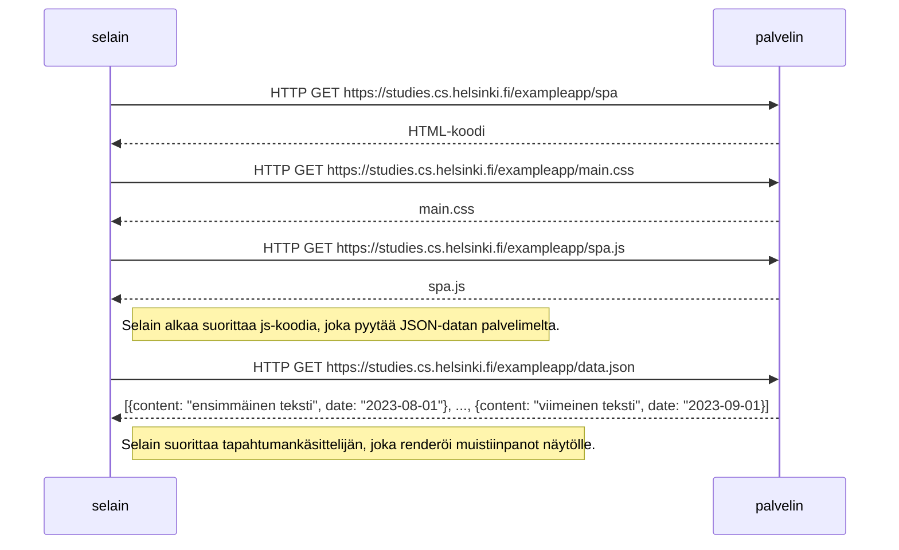

```mermaid
sequenceDiagram
    participant selain
    participant palvelin
    
    selain->>palvelin: HTTP GET https://studies.cs.helsinki.fi/exampleapp/spa
    palvelin-->>selain: HTML-koodi
    selain->>palvelin: HTTP GET https://studies.cs.helsinki.fi/exampleapp/main.css
    palvelin-->>selain: main.css
    selain->>palvelin: HTTP GET https://studies.cs.helsinki.fi/exampleapp/spa.js
    palvelin-->>selain: spa.js

    Note right of selain: Selain alkaa suorittaa js-koodia, joka pyytää JSON-datan palvelimelta.

    selain->>palvelin: HTTP GET https://studies.cs.helsinki.fi/exampleapp/data.json
    palvelin-->>selain: [{content: "ensimmäinen teksti", date: "2023-08-01"}, ..., {content: "viimeinen teksti", date: "2023-09-01}]

    Note right of selain: Selain suorittaa tapahtumankäsittelijän, joka renderöi muistiinpanot näytölle.
```
