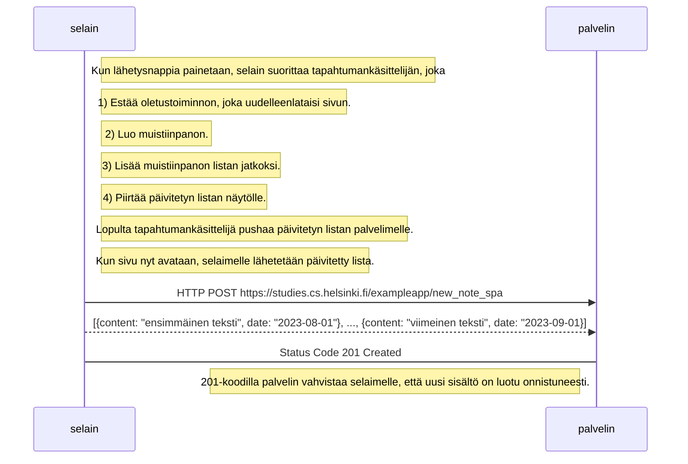

```mermaid
sequenceDiagram
    participant selain
    participant palvelin
    
    Note right of selain: Kun lähetysnappia painetaan, selain suorittaa tapahtumankäsittelijän, joka
    Note right of selain: 1) Estää oletustoiminnon, joka uudelleenlataisi sivun.
    Note right of selain: 2) Luo muistiinpanon.
    Note right of selain: 3) Lisää muistiinpanon listan jatkoksi.
    Note right of selain: 4) Piirtää päivitetyn listan näytölle.

    Note right of selain: Lopulta tapahtumankäsittelijä pushaa päivitetyn listan palvelimelle.
    Note right of selain: Kun sivu nyt avataan, selaimelle lähetetään päivitetty lista.

    selain->>palvelin: HTTP POST https://studies.cs.helsinki.fi/exampleapp/new_note_spa
    selain-->>palvelin: [{content: "ensimmäinen teksti", date: "2023-08-01"}, ..., {content: "viimeinen teksti", date: "2023-09-01}]
    palvelin->selain: Status Code 201 Created
    Note left of palvelin: 201-koodilla palvelin vahvistaa selaimelle, että uusi sisältö on luotu onnistuneesti.
```
