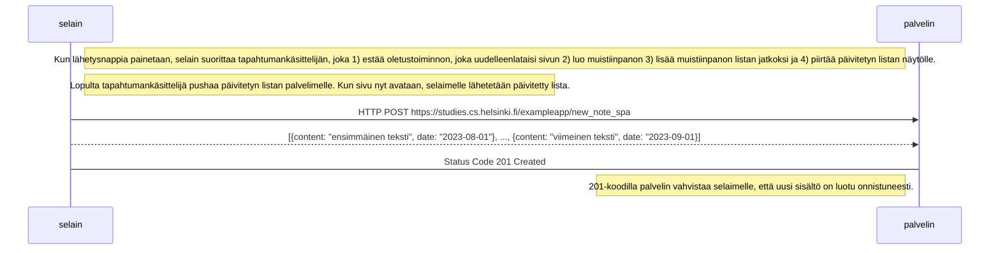

```mermaid
sequenceDiagram
    participant selain
    participant palvelin
    
    Note right of selain: Kun lähetysnappia painetaan, selain suorittaa tapahtumankäsittelijän, joka 1) estää oletustoiminnon, joka uudelleenlataisi sivun 2) luo muistiinpanon 3) lisää muistiinpanon listan jatkoksi ja 4) piirtää päivitetyn listan näytölle.

    Note right of selain: Lopulta tapahtumankäsittelijä pushaa päivitetyn listan palvelimelle. Kun sivu nyt avataan, selaimelle lähetetään päivitetty lista.

    selain->>palvelin: HTTP POST https://studies.cs.helsinki.fi/exampleapp/new_note_spa
    selain-->>palvelin: [{content: "ensimmäinen teksti", date: "2023-08-01"}, ..., {content: "viimeinen teksti", date: "2023-09-01}]
    palvelin->selain: Status Code 201 Created
    Note left of palvelin: 201-koodilla palvelin vahvistaa selaimelle, että uusi sisältö on luotu onnistuneesti.
```
